# 冰迹·EdgeFlow - 花样滑冰训练助手

<div align="center">


**专业的花样滑冰训练记录与分析工具**

[功能介绍](#功能介绍) | [截图展示](#截图展示) | [快速开始](#快速开始) | [技术架构](#技术架构)

</div>

---

## 📖 项目简介

**冰迹·EdgeFlow** 是一款基于 HarmonyOS 开发的花样滑冰训练辅助应用，为花滑爱好者提供全方位的训练记录、技术分析、计分模拟等功能。应用采用多设备适配设计，支持手机、平板、2in1设备、智能手表等多种设备形态。

### 核心特性

- 🎯 **训练计时** - 精确记录训练时长与动作组合
- 📊 **数据分析** - 可视化统计训练成果与进步曲线
- ⛸️ **动作库管理** - 完整的花滑动作库与自定义扩展
- 🏆 **计分模拟** - 基于ISU规则的官方计分系统
- 📱 **多设备适配** - 响应式布局，支持多种设备形态
- 🔄 **跨设备流转** - HarmonyOS分布式能力，无缝切换设备

---

## 🎯 功能介绍

### 一、训练台（首页）

训练台是应用的核心功能模块，提供完整的训练记录与管理功能。

#### 主要功能

| 功能 | 描述 |
|------|------|
| **计时训练** | 实时计时、暂停、结束训练 |
| **动作选择** | 选择本次训练的动作组合（跳跃/旋转/步法） |
| **疲劳度计算** | 根据动作类型自动计算训练疲劳度 |
| **历史记录** | 查看今日训练历史，支持删除记录 |
| **周训练计划** | 制定每周训练计划，设置每日目标 |

#### 支持的动作类型

- **跳跃动作**：1A-4A, 1Lz-3Lz, 1F-3F, 1Lo-3Lo, 1S-3S, 1T-3T
- **旋转动作**：USp, SSp, CSp, LSp, CCoSp
- **步法序列**：StSq, CiSt, RoLi, SlSt

---

### 二、动作库

技战术档案与笔记沉淀中心，帮助用户系统管理花滑技术动作。

#### 功能特色

- 🔍 **分类浏览** - 按跳跃/旋转/步法分类查看
- 📊 **掌握度评估** - S/A/B/C四级掌握度标注
- 🔎 **搜索筛选** - 快速搜索动作名称或缩写
- ✏️ **自定义动作** - 添加个人动作笔记与要点
- 📋 **详情查看** - 查看练习历史时间轴与动作要点

---

### 三、冰闻

每日新闻与科普聚合页，紧跟花滑圈动态。

#### 内容模块

| 模块 | 内容 |
|------|------|
| **热点Banner** | 轮播展示重要花滑新闻 |
| **每日知识** | 每日一条花滑知识问答 |
| **今日赛程** | 显示即将开始的比赛信息 |
| **新闻列表** | 赛事、选手、规则等多类新闻 |
| **科普专栏** | 技术解剖、装备保养、体能训练、运动康复 |

---

### 四、成就

数据可视化统计页面，直观展示训练成果。

#### 统计维度

- 📈 **总冰时** - 累计训练时长统计
- 🎯 **总训练次数** - 累计训练场次
- 📊 **动作类型分布** - 跳跃/旋转/步法训练比例
- 🏆 **高频动作TOP8** - 柱状图展示最常练习的动作
- 📅 **每日练习热力图** - 30天训练方块展示（类似GitHub贡献图）

---

### 五、我的

个人中心，管理装备、歌单与设置。

#### 管理功能

- ⛸️ **装备管理** - 冰鞋、冰刀使用时长追踪与磨刀提醒
- 🎵 **训练歌单** - 短节目/自由滑音乐管理
- ⚙️ **训练设置** - 计时提醒、音乐绑定配置
- 🔔 **通知设置** - 磨刀提醒、训练提醒
- 📊 **数据管理** - 导出、备份、清除数据
- 🎨 **主题设置** - 冰蓝、极光、深空主题切换

---

### 六、计分模拟器

复刻ISU官方计分规则，帮助理解花滑评分系统。

#### 计分功能

- 📝 **节目类型选择** - 短节目(SP) / 自由滑(FS)
- 🎯 **技术元素添加** - 跳跃、旋转、步法序列
- 📊 **GOE评分** - -5到+5的执行等级评分
- 💯 **PCS输入** - 五大节目内容分（手表端隐藏）
- 📈 **实时计算** - 自动计算TES、PCS、总分

#### 支持的技术元素

**跳跃元素（基础分值示例）**

| 元素 | 1周 | 2周 | 3周 | 4周 |
|------|-----|-----|-----|-----|
| Toe Loop (T) | 0.40 | 1.30 | 3.00 | 5.40 |
| Salchow (S) | 0.40 | 1.30 | 3.00 | 5.40 |
| Loop (Lo) | 0.50 | 1.70 | 4.00 | 6.00 |
| Flip (F) | 0.50 | 1.80 | 4.00 | 6.00 |
| Lutz (Lz) | 0.60 | 2.10 | 5.00 | 6.60 |
| Axel (A) | 1.10 | 3.30 | 6.40 | 8.50 |

---

### 七、打分解读

输入分数，自动拆解技术分与内容分，深入理解评分构成。

#### 功能特点

- 📊 **分数拆解** - 输入总分，自动拆解TES与PCS
- 📋 **元素分析** - 展示每个技术元素的得分详情
- 🎭 **节目内容分** - 五大项评分明细
- 💡 **评分知识** - ISU评分规则科普

---

### 八、多设备自由流转 📱⇄💻

应用支持在手机和平板等不同设备上自由运行，界面自动适配设备屏幕，提供一致的用户体验。

#### 设备适配能力

| 设备类型 | 适配特点 |
|----------|----------|
| 📱 **手机** | 单列布局，适合单手操作，紧凑的界面设计 |
| 📟 **平板** | 多列布局，充分利用大屏空间，更丰富的信息展示 |
| ⌚ **手表** | 简化界面，核心功能优先，适合快速查看 |

#### 自由流转场景

**场景一：手机端使用**
- 适合移动场景，随时记录训练
- 单手操作便捷
- 紧凑高效的界面布局

**场景二：平板端使用**
- 大屏展示更多训练数据
- 多列布局信息一目了然
- 适合深度分析和规划

**场景三：设备切换**
- 数据自动同步
- 界面自动适配
- 无缝切换体验

---

## 📸 截图展示

### 主界面截图

<div align="center">

| 训练台 | 动作库 | 成就 |
|:------:|:------:|:------:|
| 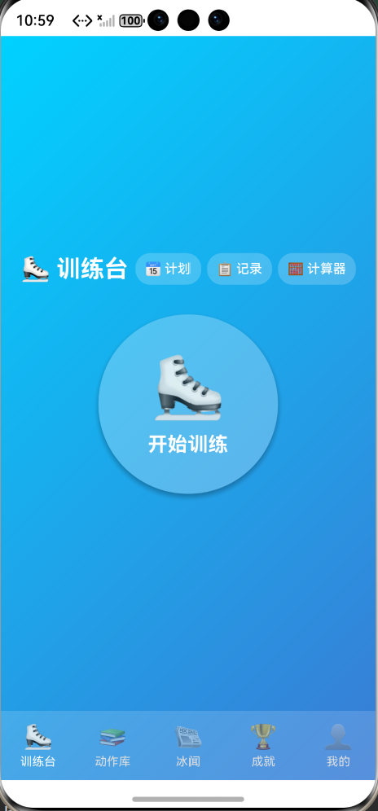 | 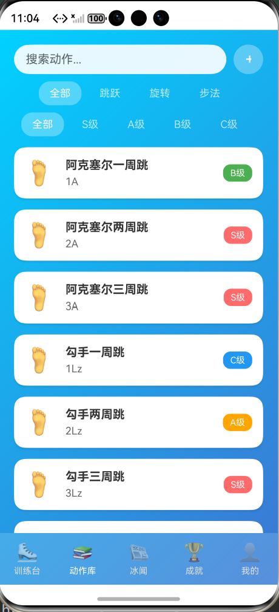 | 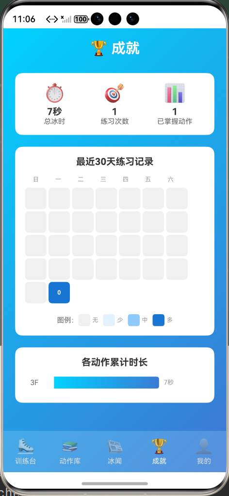 |

| 我的 | 计分模拟器 |
|:------:|:------:|
| 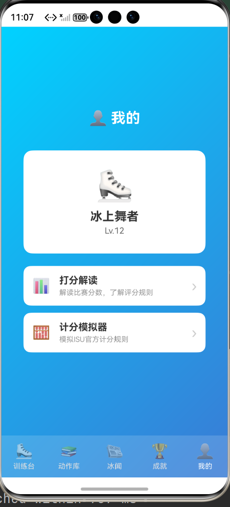 | 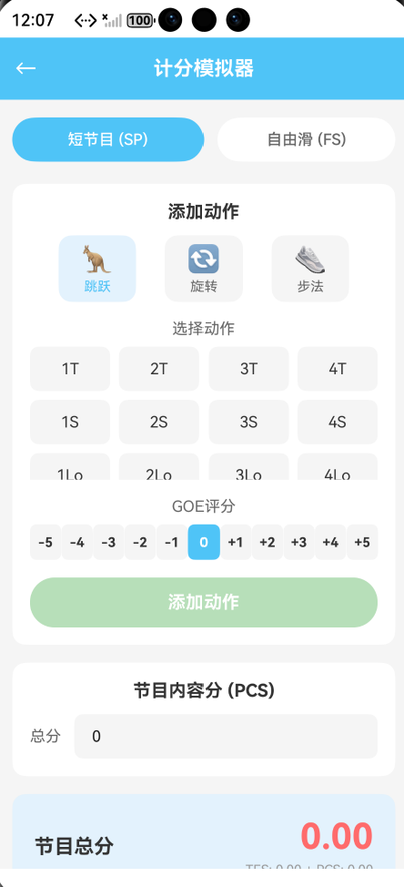 |

</div>

### 功能详情截图

<div align="center">

| 训练计时器 | 历史记录 | 周训练计划 |
|:----------:|:--------:|:----------:|
| 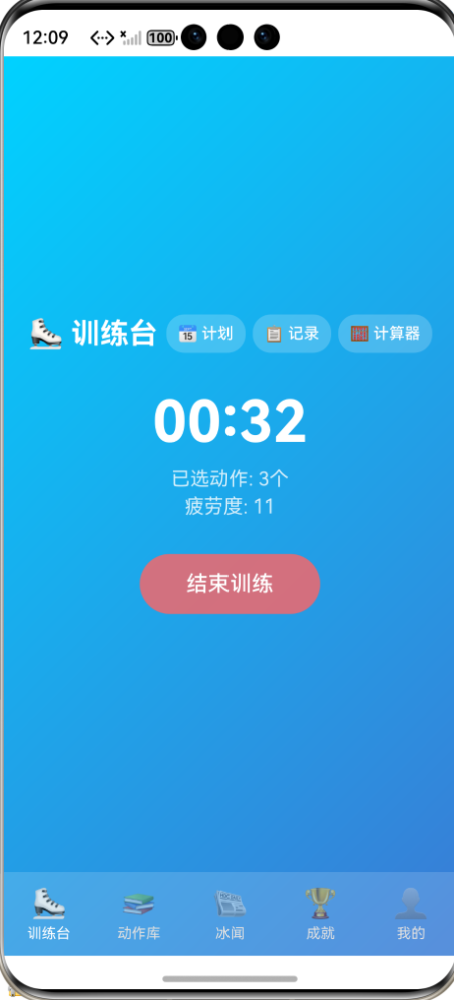 | 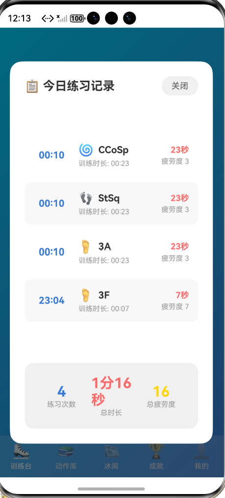 | 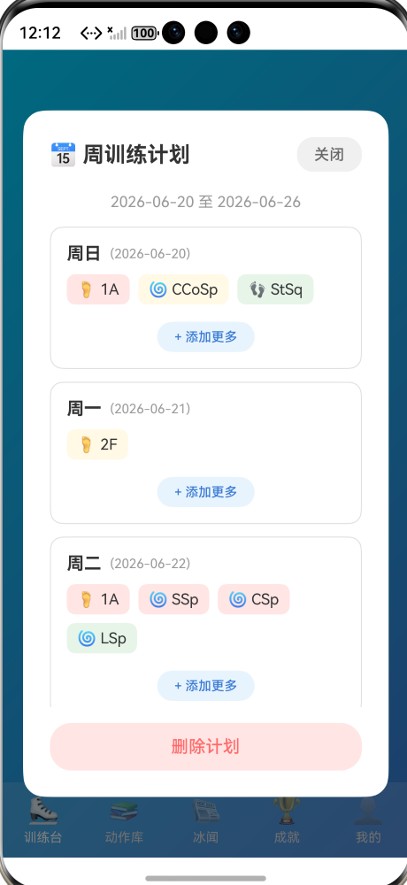 |

| 动作详情 | 选择动作 | 添加自定义动作 |
|:--------:|:--------:|:--------------:|
| 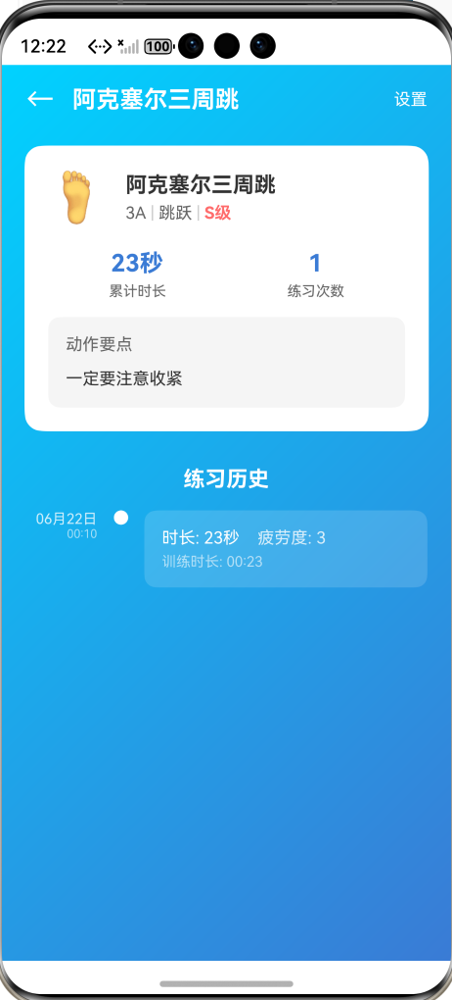 | 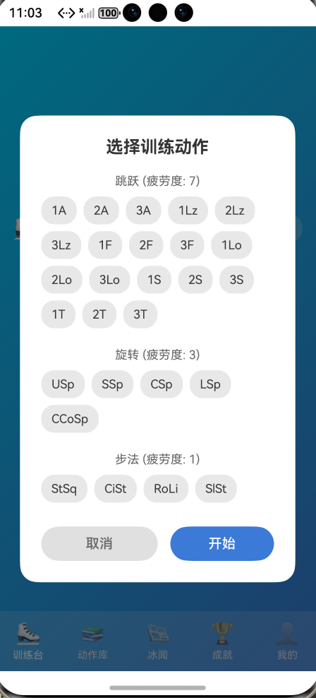 |  |

| 打分解读1 | 打分解读2 |
|:--------:|:--------:|
| 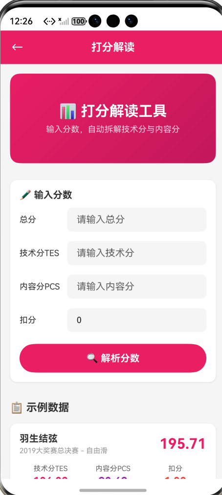 | 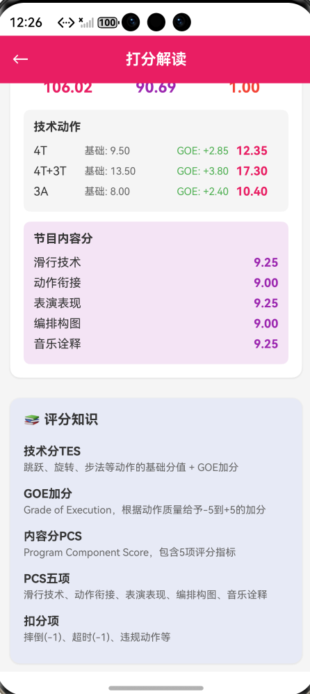 |

</div>

### 多设备适配截图（自由流转）

<div align="center">

| 设备运行效果 |
|:------------:|
|  |

</div>

**自由流转说明：**
- 📱 手机端：单列布局，紧凑高效
- 📟 平板端：多列布局，信息丰富
- 🔄 同一应用在不同设备上自动适配界面
- ☁️ 数据同步，无缝切换

---

## 🚀 快速开始

### 环境要求

| 项目 | 版本要求 |
|------|----------|
| HarmonyOS | HarmonyOS 5.0.5 Release 或更高版本 |
| DevEco Studio | DevEco Studio 6.0.2 Release 或更高版本 |
| HarmonyOS SDK | HarmonyOS 6.0.2 Release SDK 或更高版本 |

### 支持设备

- 📱 华为手机（标准系统）
- 📟 华为平板
- 💻 2in1设备
- ⌚ 华为智能手表

### 安装运行

1. **克隆项目**
   ```bash
   git clone <repository-url>
   cd SimpleCalculator-master
   ```

2. **打开项目**
   - 使用 DevEco Studio 打开项目根目录
   - 等待项目同步完成

3. **运行应用**
   - 连接 HarmonyOS 设备或启动模拟器
   - 点击运行按钮安装应用

---

## 🏗️ 技术架构

### 项目结构

```
entry/src/main/
├── ets/
│   ├── pages/                    # 页面组件
│   │   ├── EdgeFlowMainPage.ets  # 主导航页面（底部五Tab）
│   │   ├── MoveLibraryPage.ets   # 动作库页面
│   │   ├── IceNewsPage.ets       # 冰闻页面
│   │   ├── AchievementPage.ets   # 成就页面
│   │   ├── ProfilePage.ets       # 我的页面
│   │   ├── ScoringSimulatorPage.ets  # 计分模拟器
│   │   ├── ScoreInterpreterPage.ets  # 打分解读
│   │   └── MoveDetailPage.ets    # 动作详情页
│   ├── common/
│   │   ├── components/           # 公共组件
│   │   │   ├── IceNavBar.ets     # 导航栏组件
│   │   │   ├── IceCard.ets       # 卡片组件
│   │   │   ├── IceTag.ets        # 标签组件
│   │   │   ├── IceFilterBar.ets  # 筛选栏组件
│   │   │   ├── IceSearchBar.ets  # 搜索栏组件
│   │   │   ├── IceLoading.ets    # 加载组件
│   │   │   └── IceEmpty.ets      # 空状态组件
│   │   ├── constants/            # 常量定义
│   │   └── utils/                # 工具类
│   │       ├── DeviceUtils.ets   # 设备适配工具
│   │       ├── ResponsiveLayout.ets  # 响应式布局
│   │       └── BreakpointSystem.ets  # 断点系统
│   ├── models/                   # 数据模型
│   │   └── IceTraceData.ets      # 核心数据结构
│   ├── services/                 # 服务层
│   │   ├── DataStore.ets         # 数据存储服务
│   │   └── DistributedDataManager.ets  # 分布式数据管理
│   ├── viewmodel/                # 视图模型
│   │   ├── TechnicalElementModel.ets  # 技术元素模型
│   │   └── PageModels.ets        # 页面数据模型
│   └── utils/                    # 工具类
│       └── TestDataGenerator.ets # 测试数据生成器
├── resources/                    # 资源文件
│   ├── base/
│   │   ├── element/              # 字符串、颜色等资源
│   │   ├── media/                # 图片资源
│   │   └── profile/              # 配置文件
│   │       └── main_pages.json   # 页面路由配置
└── module.json5                  # 模块配置
```

### 核心技术

| 技术 | 应用场景 |
|------|----------|
| **ArkTS** | 应用开发语言，TypeScript扩展 |
| **ArkUI** | 声明式UI开发框架 |
| **@State/@Prop** | 状态管理与数据传递 |
| **LocalStorage** | 本地数据持久化 |
| **分布式数据** | 多设备数据同步 |
| **响应式布局** | 多设备适配 |

### 设计模式

- **单例模式** - DataStore数据存储服务
- **MVVM架构** - 页面与数据分离
- **组件化设计** - 可复用UI组件库

---

## 📋 权限说明

应用需要以下权限：

| 权限 | 类型 | 用途 |
|------|------|------|
| `ohos.permission.DISTRIBUTED_DATASYNC` | system_grant | 分布式数据同步，支持多设备数据同步 |

---

## 🎨 设计规范

### 配色方案

- **主色调**：冰蓝色系 (#4FC3F7, #29B6F6, #03A9F4)
- **辅助色**：渐变紫 (#667eea, #764ba2)
- **强调色**：活力橙 (#FF6B6B)
- **背景色**：浅灰 (#F5F5F5)

### 设计原则

- 遵循 HarmonyOS Design Language
- 卡片式布局，层次分明
- 冰雪主题视觉元素
- 流畅的动画过渡

---

## 📝 更新日志

### v1.0.0 (2024)

**新增功能**
- ✅ 训练计时与记录功能
- ✅ 动作库管理系统
- ✅ 冰闻资讯聚合
- ✅ 成就数据统计
- ✅ 计分模拟器
- ✅ 打分解读工具
- ✅ 多设备适配（手机、平板、手表）
- ✅ 自由流转（界面自动适配不同设备）

---

## 🤝 贡献指南

欢迎提交 Issue 和 Pull Request 来帮助改进这个项目！

### 贡献流程

1. Fork 本仓库
2. 创建功能分支 (`git checkout -b feature/AmazingFeature`)
3. 提交更改 (`git commit -m 'Add some AmazingFeature'`)
4. 推送到分支 (`git push origin feature/AmazingFeature`)
5. 提交 Pull Request

---

## 📄 许可证

本项目基于 [Apache License 2.0](LICENSE) 许可证开源。

---

## 🙏 致谢

- 感谢 HarmonyOS 官方提供的开发框架与文档
- 感谢 ISU（国际滑冰联盟）提供的官方评分规则
- 感谢所有贡献者的支持

---

<div align="center">

**⛸️ 冰迹·EdgeFlow - 记录每一次冰上足迹**

Made with ❤️ for Figure Skating

</div>
