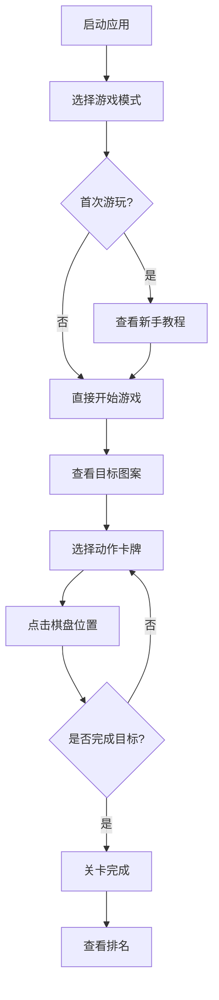

# 多功能计算器应用

## 项目概述

基于HarmonyOS ArkTS开发的多功能计算器应用，包含技术元素计算器和花样滑冰解谜游戏两大功能模块。


## 功能特性

### 一、花样滑冰技术元素计算器 ⛸️

基于ISU（国际滑冰联盟）官方评分系统的技术元素计算器，支持：
- **跳跃元素计算**：1-4周的Toe Loop、Salchow、Loop、Flip、Lutz、Axel
- **旋转元素计算**：直立旋转、蹲转、驼转、弓身旋转等
- **步法序列计算**：Level 1-4的步法序列
- **GOE评分系统**：-5到+5的GOE评分调整
- **实时得分计算**：基础分值 + GOE调整分 = 最终得分
- **多元素累加**：支持添加多个技术元素并计算总分

#### 界面展示

<div align="center">
  
  <p><em>技术元素计算器主界面</em></p>
</div>

<div align="center">
  
  
  <p><em>元素选择与GOE评分</em></p>
</div>

#### 使用说明

1. 在主页面选择"技术元素计算器"
2. 选择技术元素类型（跳跃/旋转/步法）
3. 从列表中选择具体的技术元素
4. 选择GOE评分（-5到+5）
5. 查看计算结果并点击"添加元素"
6. 继续添加其他元素或查看总分

#### 计算规则

- **基础分值**：根据ISU官方技术手册确定
- **GOE调整分** = GOE × 基础分值 × 0.1
- **最终得分** = 基础分值 + GOE调整分
- **技术分总分** = 所有技术元素得分之和

#### 支持的技术元素

**跳跃元素（基础分值）**
| 元素 | 1周 | 2周 | 3周 | 4周 |
|------|-----|-----|-----|-----|
| Toe Loop (T) | 0.40 | 1.30 | 3.00 | 5.40 |
| Salchow (S) | 0.40 | 1.30 | 3.00 | 5.40 |
| Loop (Lo) | 0.50 | 1.70 | 4.00 | 6.00 |
| Flip (F) | 0.50 | 1.80 | 4.00 | 6.00 |
| Lutz (Lz) | 0.60 | 2.10 | 5.00 | 6.60 |
| Axel (A) | 1.10 | 3.30 | 6.40 | 8.50 |

**旋转元素（基础分值）**
| 元素 | Level 1 | Level 2 | Level 3 | Level 4 |
|------|---------|---------|---------|---------|
| Upright Spin (USp) | 1.50 | 2.00 | 2.50 | 3.00 |
| Sit Spin (SSp) | 1.70 | 2.50 | 3.00 | 3.50 |
| Camel Spin (CSp) | 1.80 | 2.50 | 3.00 | 3.50 |
| Layback Spin (LSp) | 1.70 | 2.50 | 3.00 | 3.50 |

**步法序列（基础分值）**
| 元素 | Level 1 | Level 2 | Level 3 | Level 4 |
|------|---------|---------|---------|---------|
| Step Sequence (StSq) | 1.50 | 2.00 | 2.50 | 3.00 |

---

### 二、花样滑冰解谜游戏 ⛸️

基于花样滑冰主题的3×3棋盘解谜游戏，包含以下功能模块：

#### 游戏模式选择

<div align="center">
  
  <p><em>游戏模式选择页面</em></p>
</div>

#### 2.1 关卡模式 🎯

- 从简单到困难的渐进式关卡设计
- 6个难度等级：教程、简单、普通、困难、专家、大师
- 每个关卡有独特的目标图案
- 关卡进度保存和解锁机制

<div align="center">
  
  <p><em>关卡选择页面</em></p>
</div>

#### 2.2 新手教程 📖

- 自动演示游戏玩法
- 分步骤讲解游戏规则
- 交互式教学体验
- 快速上手指导

<div align="center">
  
  <p><em>新手教程页面</em></p>
</div>

> **💡 提示**：新手教程支持自动演示游戏玩法，建议录制GIF动图或视频展示教程流程。详见 `VIDEO_EMBED_GUIDE.md`

#### 2.3 经典模式 🎮

- 随机生成关卡
- 自由练习模式
- 无时间限制
- 适合熟悉游戏机制

<div align="center">
  
  <p><em>经典模式界面</em></p>
</div>

#### 2.4 每日挑战 🏆

- 每日更新的固定关卡
- 全球玩家排名竞争
- 限时挑战机制
- 丰厚奖励系统

<div align="center">
  
  <p><em>每日挑战界面</em></p>
</div>

#### 2.5 排行榜 📊

- 全球排名展示
- 今日排名筛选
- 成绩详情查看
- 排名图标和奖牌展示

<div align="center">
  
  <p><em>排行榜页面</em></p>
</div>

#### 2.6 游戏帮助 ❓

- 详细的游戏规则说明
- 15种动作卡牌介绍
- 评分机制说明
- 游戏模式介绍

<div align="center">
  
  <p><em>游戏帮助页面</em></p>
</div>

---

### 核心玩法展示

#### 游戏主界面

<div align="center">
  
  <p><em>解谜游戏主界面</em></p>
</div>

#### 棋盘系统

<div align="center">
  
  <p><em>3×3滑冰场地棋盘</em></p>
</div>

**棋盘说明：**
- 3×3的滑冰场地，每个格子放置不同奖牌
- 🥇 金牌、🥈 银牌、🥉 铜牌
- 需要通过动作卡牌改变棋盘状态

#### 动作卡牌系统

<div align="center">
  
  <p><em>动作卡牌展示</em></p>
</div>

#### 目标图案系统

<div align="center">
  
  <p><em>目标图案展示</em></p>
</div>

#### 关卡完成

<div align="center">
  
  <p><em>关卡完成界面</em></p>
</div>

---

### 动作卡牌类型详解

游戏包含15种动作卡牌，每种代表不同的花样滑冰动作：

| 卡牌类型 | 图标 | 功能描述 | 消耗步数 |
|---------|------|----------|---------|
| Spin（旋转） | 🔄 | 翻转整列奖牌 | 2 |
| Jump（跳跃） | 🦘 | 交换两堆奖牌 | 3 |
| Pose（姿势） | 💃 | 堆叠相邻奖牌 | 2 |
| Step Sequence（步法序列） | 👟 | 移动奖牌位置 | 2 |
| Spiral（螺旋） | 🌀 | 旋转奖牌方向 | 3 |
| Lift（托举） | 🤼 | 提升奖牌等级 | 4 |
| Twizzle（旋转步） | 💫 | 快速旋转 | 2 |
| Combination（组合） | 🔀 | 组合动作 | 3 |
| Transition（过渡） | ➡️ | 平滑移动 | 1 |
| Spin Combination（旋转组合） | 🌀🔄 | 多次旋转 | 4 |
| Jump Combination（跳跃组合） | 🦘🦘 | 连续跳跃 | 5 |
| Change Edge（变刃） | ↔️ | 改变方向 | 2 |
| Spread Eagle（展翅） | 🦅 | 扩展范围 | 3 |
| Ina Bauer（伊娜鲍尔） | ⛸️ | 特殊姿势 | 3 |
| Cantilever（悬臂） | ⚖️ | 平衡动作 | 4 |

---

## 项目结构

```
entry/src/main/ets/
├── pages/
│   ├── MainPage.ets              # 主页面（功能选择）
│   ├── HomePage.ets              # 普通计算器页面
│   ├── GameModePage.ets          # 游戏模式选择页面
│   ├── LevelSelectPage.ets       # 关卡选择页面
│   ├── PuzzleGamePage.ets        # 解谜游戏主页面
│   ├── GameTutorialPage.ets      # 新手教程页面
│   ├── LeaderboardPage.ets       # 排行榜页面
│   └── GameHelpPage.ets          # 游戏帮助页面
├── viewmodel/
│   ├── PressKeysItem.ets         # 按键数据模型
│   ├── PresskeysViewModel.ets    # 按键视图模型
│   ├── PuzzleGameModel.ets       # 解谜游戏数据模型
│   ├── LevelModel.ets            # 关卡数据模型
│   └── LevelData.ets             # 关卡配置数据
└── common/
    ├── constants/
    │   └── CommonConstants.ets   # 公共常量
    └── util/
        ├── CalculateUtil.ets     # 计算工具
        ├── CheckEmptyUtil.ets    # 空值检查工具
        ├── Logger.ets            # 日志工具
        ├── PuzzleGameEngine.ets  # 解谜游戏引擎
        ├── LeaderboardManager.ets# 排行榜管理器
        └── DataExporter.ets      # 数据导出工具
```

---

## 技术实现

### 核心技术

- **HarmonyOS SDK** - 原生应用开发框架
- **ArkTS语言** - TypeScript的扩展语言
- **ArkUI组件** - 声明式UI开发
- **状态管理** - @State、@Prop装饰器

### 关键特性

- **ForEach循环渲染** - 动态列表渲染
- **TextInput组件** - 表达式输入
- **Image组件** - 图形显示
- **路由导航** - 页面跳转管理
- **数据持久化** - 本地数据存储

### 游戏引擎架构

```typescript
// 游戏状态管理
class PuzzleGameEngine {
  initializeGame(mode: GameMode)  // 初始化游戏
  startGame()                     // 开始游戏
  executeAction(card, params)     // 执行动作
  checkCompletion()               // 检查完成
  calculateScore()                // 计算得分
}
```

---

## 开发环境

### 基础要求

| 项目 | 版本要求 |
|-----|---------|
| HarmonyOS | HarmonyOS 5.0.5 Release 或更高版本 |
| DevEco Studio | DevEco Studio 6.0.2 Release 或更高版本 |
| HarmonyOS SDK | HarmonyOS 6.0.2 Release SDK 或更高版本 |

### 支持设备

- 华为手机（标准系统）

---

## 使用指南

### 快速开始

1. 启动应用后显示主页面
2. 选择"普通计算器"或"花样滑冰解谜"
3. 根据选择的模式进入相应功能

### 解谜游戏流程



### 游戏技巧

- 🎯 **仔细观察目标图案**，规划最优路径
- 🃏 **合理使用卡牌**，不同卡牌有不同效果
- ⏱️ **注意步数限制**，追求高分
- 🎮 **多练习经典模式**，熟悉各种卡牌效果
- 📊 **查看排行榜**，学习高手策略

---

## 版本信息

| 项目 | 内容 |
|-----|------|
| 版本 | 1.0.0 |
| 更新日期 | 2024 |
| 开发者 | 基于SimpleCalculator项目扩展 |

---

## 许可证

Apache License 2.0

---

## 贡献指南

欢迎提交Issue和Pull Request来帮助改进这个项目！

### 如何贡献

1. Fork 本仓库
2. 创建新的功能分支 (`git checkout -b feature/AmazingFeature`)
3. 提交更改 (`git commit -m 'Add some AmazingFeature'`)
4. 推送到分支 (`git push origin feature/AmazingFeature`)
5. 提交 Pull Request

---

**注意**: 本项目仅供学习和演示使用，基于HarmonyOS官方示例SimpleCalculator扩展开发。

**截图说明**: 请将实际的界面截图保存到 `screenshots/` 文件夹中，并确保文件名与README中引用的路径一致。详细的截图需求列表请查看 `screenshots/README.md`。
